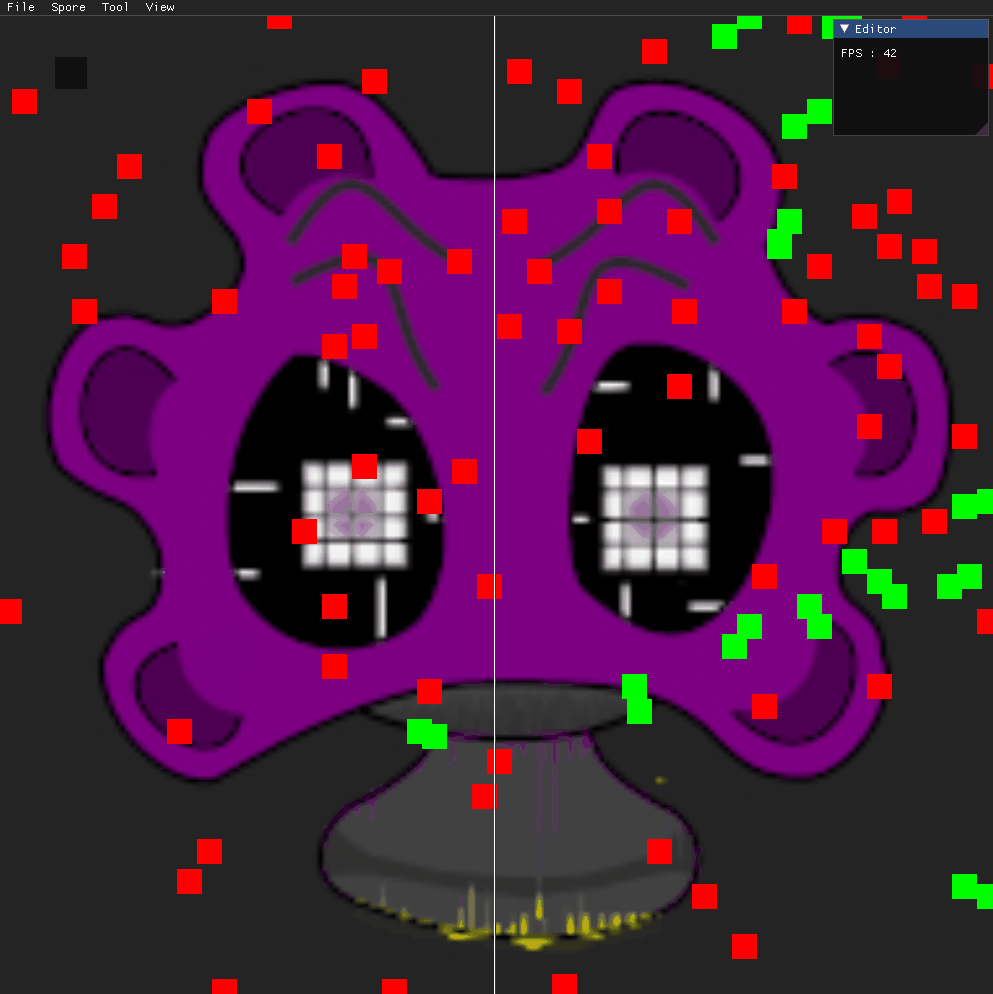

# ⚙️ EMP (Engine Mushroom Project)  — Experimental Engine Project
<p align="center">
  
</p>

## 🧠 Overview

EMP est un projet personnel de moteur de jeu développé en C++.  
Je l’utilise comme un terrain d’expérimentation pour explorer la conception d’un engine, la programmation bas niveau et l’architecture de systèmes.

L’objectif n’est pas de produire un moteur “fini”, mais de comprendre en profondeur comment les différentes briques d’un moteur fonctionnent et interagissent entre elles.

---

## 🎯 Objectifs du projet

- Approfondir la programmation C++
- Comprendre l’architecture d’un moteur de jeu
- Expérimenter des systèmes modulaires (ECS, rendering, etc.)
- Travailler avec des librairies bas niveau (OpenGL, SDL, etc.)

---

## 🧩 Fonctionnalités actuelles

Le projet est en développement actif, mais inclut déjà :

- 🔧 Initialisation d’un moteur avec cycle de vie (Init / Update / Destroy)
- 🧱 Architecture orientée systèmes (SystemManager, EntityManager, ComponentManager)
- 🎮 Gestion d’entités et composants (approche ECS simplifiée)
- 🖥️ Rendering basé sur OpenGL
- 🧰 Intégration d’un éditeur (ImGui)
- 📦 Chargement de ressources (modèles, textures)
- 🧪 Exécutable de tests dédié

---

## 🏗️ Architecture

Le projet est structuré en plusieurs modules :

- `core` → cœur du moteur (Engine, systèmes)
- `components` → composants ECS
- `graphic` → rendu (OpenGL, shaders)
- `physic` → logique physique (en cours)
- `audio` → gestion audio
- `editor` → outils et interface
- `math` → structures mathématiques
- `tool` → utilitaires
- `tests` → tests et expérimentations

---

## ⚙️ Technologies utilisées

- **C++**
- **OpenGL**
- **SDL2**
- **GLEW**
- **GLM**
- **Assimp**
- **FreeType**
- **ImGui**

---

## ▶️ Build & Run

### Prérequis

- CMake
- Compilateur C++ (MSVC / GCC / Clang)

### Build

```bash
git clone https://github.com/AbominableSandwish/EMP.git
cd EMP
mkdir build
cd build
cmake ..
cmake --build .
```

# Galery



